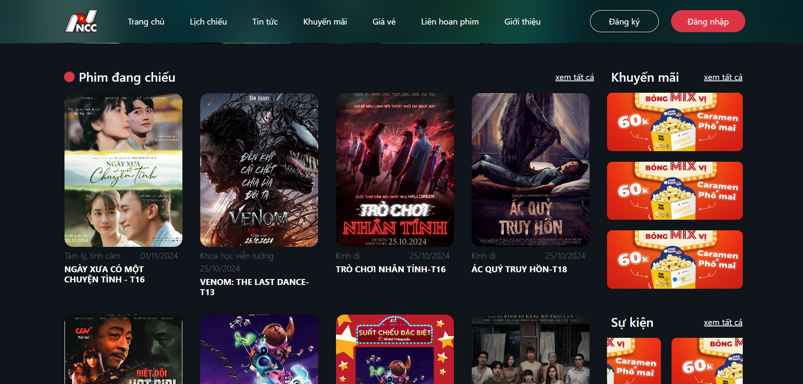
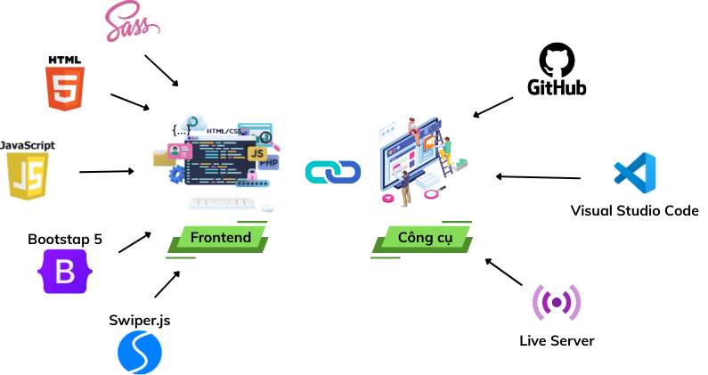

# Xây dựng Website hỏi đáp về CNTT - FPT IT

**Dự án “Xây dựng Website hỏi đáp về CNTT - FPT IT” là một nền tảng hỏi đáp trực tuyến lấy cảm hứng từ StackOverflow, do tôi trực tiếp phát triển. Website cho phép người dùng quản lý kỹ năng, câu hỏi, câu trả lời, task, hệ thống like/dislike và điểm uy tín, được xây dựng theo mô hình MVC với Java Spring Boot, giao diện JSP, tích hợp Markdown và RichText để tối ưu trải nghiệm đăng tải nội dung chuyên nghiệp.**

---

## 📋 Tổng quan Dự án

*   **Loại dự án:** Dự án môn học
*   **Thời gian:** 2024
*   **Mô tả:** Dự án hướng đến việc giải quyết nhu cầu trao đổi kiến thức, hỗ trợ học tập và làm việc trong lĩnh vực CNTT thông qua một nền tảng hỏi đáp trực tuyến. Người dùng có thể đặt câu hỏi, trả lời, đánh giá chất lượng nội dung bằng hệ thống like/dislike và tích lũy điểm uy tín, từ đó hình thành cộng đồng chia sẻ tri thức hiệu quả. Hệ thống còn hỗ trợ quản lý kỹ năng và task giúp người dùng theo dõi, nâng cao năng lực cá nhân.
*   **Vai trò của tôi:** `Tác giả duy nhất` - Tôi chịu trách nhiệm 100% cho toàn bộ dự án.

---

## 🚀 Công nghệ & Thư viện Sử dụng

Bảng dưới đây liệt kê các công nghệ và thư viện chính được áp dụng trong dự án cùng vai trò cụ thể:

| Công nghệ / Nền tảng | Loại | Công dụng & Vai trò trong hệ thống |
|----------------------|------|-------------------------------------|
|  | Backend Framework | Xây dựng hệ thống backend theo mô hình MVC, quản lý cấu hình, REST API và dịch vụ web. |
|  | View Template | Tạo giao diện người dùng động, tích hợp hiển thị dữ liệu từ Spring Boot. |
|  | Database Driver | Kết nối và truy vấn cơ sở dữ liệu SQL Server. |
|  | ORM | Ánh xạ dữ liệu giữa object Java và bảng trong cơ sở dữ liệu, hỗ trợ query HQL. |
|  | Annotation Tool | Giảm code lặp lại bằng các annotation như @Getter, @Setter, @Builder. |
|  | JSP Tag Library | Hỗ trợ xử lý logic trực tiếp trong JSP (iteration, condition, format). |
|  | Utility Library | Thao tác với Java bean: copy thuộc tính, mapping, dynamic property. |
|  | Data Format | Xử lý dữ liệu JSON: parsing, tạo JSON object. |
|  | Mail API | Hỗ trợ gửi email qua SMTP, MIME, quản lý thông báo hệ thống. |
|  | CSS Framework | Thiết kế giao diện responsive, grid system, component UI hiện đại. |
|  | JS Library | Thao tác DOM, xử lý sự kiện, Ajax, hỗ trợ cross-browser. |
|  | Rich Text Editor | Cho phép người dùng viết nội dung chuyên nghiệp, dễ định dạng. |
|  | Syntax Highlighter | Tô sáng cú pháp code trong phần hỏi/đáp. |
|  | Markdown Converter | Chuyển đổi nội dung Markdown sang HTML để hiển thị đẹp mắt. |
|  | Code Formatter | Định dạng JS, CSS, HTML gọn gàng và dễ đọc. |

---

## 🧩 Kiến trúc Hệ thống

Sơ đồ dưới đây mô tả cách các thành phần trong hệ thống tương tác với nhau.

*Mô tả ngắn: Nền tảng được xây dựng theo mô hình MVC (Model-View-Controller)*

---

## ✨ Tính năng Chính

| Tính năng | Mô tả |
| :--- | :--- |
| **🔐 Đăng nhập / Đăng ký** | Người dùng có thể tạo tài khoản mới, đăng nhập vào hệ thống để sử dụng các chức năng. |
| **🔑 Quên mật khẩu / Đổi mật khẩu** | Hỗ trợ khôi phục mật khẩu qua email và đổi mật khẩu sau khi đăng nhập. |
| **🔍 Tìm kiếm câu hỏi** | Người dùng có thể tìm kiếm các câu hỏi phù hợp theo từ khóa hoặc chủ đề. |
| **✍️ Trả lời câu hỏi** | Người dùng có thể đăng câu trả lời cho câu hỏi của người khác. |
| **⭐ Đánh giá câu hỏi** | Người dùng có thể đánh giá chất lượng câu hỏi (like, vote...). |
| **💬 Bình luận câu trả lời** | Người dùng có thể bình luận và thảo luận dưới các câu trả lời. |
| **💭 Bình luận câu hỏi** | Người dùng có thể để lại ý kiến hoặc thảo luận trực tiếp dưới câu hỏi. |
| **👤 Tìm kiếm người dùng** | Cho phép tìm kiếm và kết nối với những người dùng khác. |
| **👥 Xem thông tin người dùng** | Hiển thị hồ sơ công khai của người dùng khác (thông tin cơ bản, hoạt động...). |
| **⚙️ Quản lý thông tin cá nhân** | Người dùng có thể chỉnh sửa hồ sơ, avatar, và cài đặt cá nhân. |
| **❓ Quản lý câu hỏi** | Người dùng có thể đăng, chỉnh sửa hoặc xóa câu hỏi của mình. |
| **📂 Quản lý chủ đề (Admin)** | Admin có thể tạo, chỉnh sửa hoặc xóa các chủ đề để phân loại câu hỏi. |
| **🚫 Ẩn câu hỏi (Admin)** | Admin có quyền ẩn các câu hỏi vi phạm quy định hoặc không phù hợp. |
| **🔒 Vô hiệu hóa người dùng (Admin)** | Admin có thể khóa tài khoản người dùng khi phát hiện vi phạm. |

---

## 🎥 Demo

*   **Video Demo:** Toàn bộ luồng hoạt động của sản phẩm đã được ghi lại trong video này. **[Nhấn vào đây để xem!](https://youtu.be/1Lyc-CughZc)**