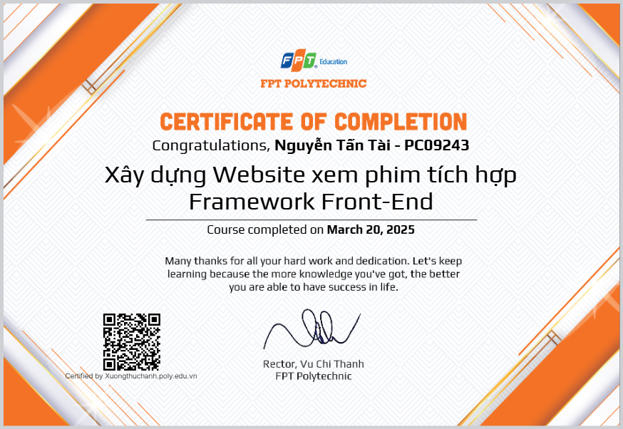

# Thiết kế sơ đồ Use Case, Activity, ERD cho Hệ thống quản lý thư viện

**Dự án “Thiết kế sơ đồ Use Case, Activity, ERD cho Hệ thống Quản lý Thư viện” tập trung vào việc phân tích và mô hình hóa các yêu cầu chức năng, phi chức năng của hệ thống nhằm tối ưu hóa quy trình quản lý sách, thành viên và hoạt động mượn trả trong thư viện. Thông qua việc xây dựng các sơ đồ UML và ERD, nhóm đã thể hiện được cách thức hệ thống vận hành, hỗ trợ thủ thư trong công tác quản lý và mang đến trải nghiệm thuận tiện hơn cho người dùng.**

---

## 📋 Tổng quan Dự án

*   **Loại dự án:** Dự án xưởng
*   **Thời gian:** 09/2024 - 10/2024
*   **Mô tả:** Dự án giải quyết bài toán quản lý thư viện truyền thống vốn thủ công, tốn nhiều thời gian và dễ sai sót trong việc theo dõi số lượng sách, tình trạng mượn trả và thông tin thành viên. Hệ thống được xây dựng nhằm tự động hóa các nghiệp vụ như phân loại, tra cứu, đăng ký, mượn trả, đồng thời cung cấp giao diện thân thiện giúp người dùng dễ dàng tiếp cận dịch vụ thư viện. Qua đó, dự án góp phần nâng cao hiệu quả làm việc của thủ thư và mang lại trải nghiệm thuận tiện, nhanh chóng cho người đọc.
*   **Vai trò của tôi:**
    *   `Trưởng nhóm phân tích chức năng & phi chức năng:` Phân công công việc, giám sát tiến độ, kiểm tra sản phẩm và đảm bảo hoàn thiện đúng yêu cầu.
    *   `Trưởng nhóm Hỏi - Đáp yêu cầu & chức năng:` Điều phối quá trình trao đổi, làm rõ yêu cầu, giải đáp thắc mắc và tổng hợp phản hồi.
    *   `Trưởng nhóm thiết kế Use Case:` Quản lý nhóm, phân chia nhiệm vụ và trực tiếp xây dựng sơ đồ Use Case cho hệ thống.
    *   `Trưởng nhóm thiết kế Sơ đồ lớp:` Phân công công việc, theo dõi tiến độ và thực hiện vẽ sơ đồ lớp thể hiện cấu trúc hệ thống.
    *   `Trưởng nhóm thiết kế Sơ đồ hoạt động:` Điều phối nhóm, giám sát tiến độ và trực tiếp thiết kế sơ đồ hoạt động mô tả luồng xử lý nghiệp vụ.

---

## 🚀 Công nghệ & Kỹ thuật Nổi bật

Bảng dưới đây liệt kê những công cụ và nền tảng chính được sử dụng, cùng vai trò của chúng trong quá trình triển khai dự án.  

| Công nghệ / Nền tảng | Mục đích & Tích hợp |
| :--- | :--- |
|  | Thiết kế sơ đồ UML (Use Case, Activity, Class) và ERD để mô hình hóa hệ thống. |
|  | Hỗ trợ thiết kế giao diện trực quan, trình bày mockup và ý tưởng UI/UX. |
|  | Quản lý công việc, theo dõi tiến độ dự án và phân công nhiệm vụ theo mô hình Agile. |
|  | Tổ chức quy trình làm việc nhóm, quản lý task chi tiết và giám sát tiến độ. |
|  | Quản lý công việc nhóm nhỏ, theo dõi trạng thái nhiệm vụ bằng Kanban board. |
|  | Lập và quản lý test case, bảng phân công công việc, thống kê dữ liệu. |
|  | Viết và biên soạn tài liệu phân tích yêu cầu, báo cáo dự án. |

---

## 🎥 Demo

*   **Video Demo:** Toàn bộ luồng hoạt động của sản phẩm đã được ghi lại trong video này. **[Nhấn vào đây để xem!](https://youtu.be/DVt-AaA_sTI)**
*   **Thành viên:**
    1.   **Nguyễn Tấn Tài**
    2.   Nguyễn Hoàng Duy
    3.   Huỳnh Thụy Khả Tú
    4.   Nguyễn Thị Ngọc Nghi
    5.   Lê Tấn Vinh
    6.   Nguyễn Hữu Trung
    7.   Huỳnh Thị Thảo Vy
    8.   Nguyễn An Ninh
    9.   Hồ Long Hồ
    10.   Trần Minh Tiến
    11.   Nguyễn Triều Thiên
    12.   Phạm Kim Tuấn
    13.   Ngô Anh Văn
    14.   Ngô Gia Huy
    15.   Nguyễn Long Nhi
    16.   Nguyễn Khánh Duy
*   **Chứng nhận**
---
